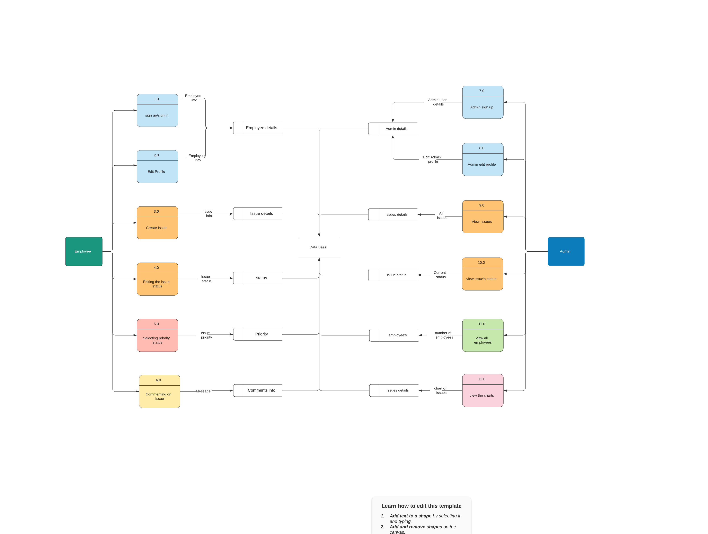
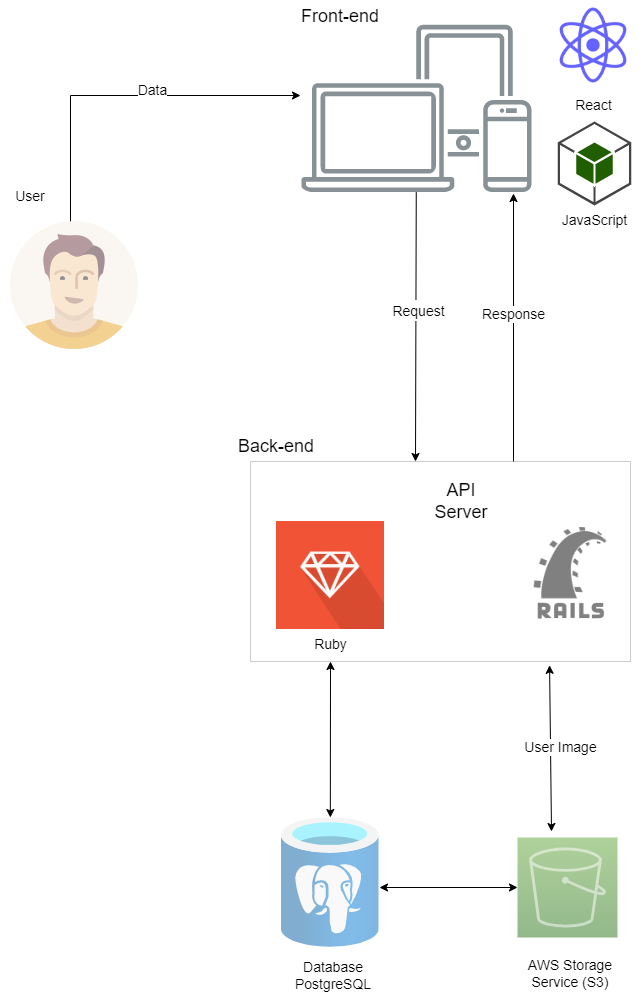

# Star Security

---

# R1 - Description of your website, including:

## Purpose

Star security is a security company that offers various services to clients. These services include providing security officer assistance to small and enterprise companies, on-site patrolling in specialized worksites, security monitoring and screening for specific areas such as airports and shopping centres, etc. The company has the obligation to run flawless and smooth operations. As a company, they must ensure and maintain trust and rapport with their clients. To achieve this, they need to have exceptional communication within their operations. However, running a security company with multiple clients and employees is not always a smooth sail. They run into issues on a regular basis concerning both parties of the operation. Some examples to these issues could be;

- Security officer calling in sick an hour before their shift
- Security officer has an emergency and has to leave the jobsite ASAP
- Client does not want to work with the security officer
- Security officer does not show up to worksite
- Security officer falls asleep on the job
- Client without notification needs more security officers

The purpose of this application is to provide a software platform for the security company to manage all their issues effectively. This application aims to provide issue tracking of operations to be managed in a way that is convinient and time efficient.

## Functionality / Features

## Target audience

## Tech stack
- Languages
    - **JavaScript** - JavaScript is a high-level, interpreted programming language that conforms to the ECMAScript specification.
    - **Ruby** - Ruby is an interpreted, high-level, general-purpose programming language.
    - **HTML** - HTML is the standard markup language for Web pages.
    - **CSS** - CSS is the language used to style an HTML document.

- Frameworks
    - **Ruby on Rails** - Ruby on Rails is a server-side web application framework written in Ruby.
    - **React** - React is a front-end JavaScript library for building user interfaces based on UI components.

- Database
    - **PostgreSQL** - Relational database management system emphasizing extensibility and SQL compliance.

- Testing Libraries
    - **rspec-rails** - rspec-rails is a testing framework for Rails.
    - **Jest** - JavaScript testing framework.

- Cloud Services
    - **Heroku** - Heroku is a platform as a service that enables developers to operate applications in the cloud.
    - **Netlify** - Hosting and serverless backend services for web applications and static websites.
    - **AWS S3** - Service that provides object storage through a web service interface.

- Gems and Node Packages
    - Gems
        - **jwt** - Ruby implementation of the RFC 7519 OAuth JSON Web Token (JWT) standard.
        - **bullet** - Detects the number of queries the application makes. 
        - **CanCanCan** - Authorization solution for Rails.
    - Node Packeges
        - **React Router** - Routing library for the React.
        - **Axios** - Promise based HTTP client for the browser and node.js

- Tools
    - **Trello** - Trello is a web-based, Kanban-style, list-making application.
    - **Figma** - Web-based, vector graphics editor and prototyping tool.
    - **Git** - Version control system.
    - **GitHub** - Internet hosting for software development and version control using Git.

---

# R2 - Dataflow Diagram

---

# R3 - Application Architecture Diagram

# R4 - User Stories

### 1. Role: Employee

- As an employee, I want to be able to create an account with my personal details.
- As an employee, I want to be able to login and logout safely.
- As an employee, I want to be able to update my personal details.
- As an employee, I want to be able to delete my profile.
- As an employee, I want to publish an issue.
- As an employee, I want to be able to participate in resolving other issues.
- As an employee, I want to be able to add other participants to my issue ticket.
- As an employee, I want to be able to see all comments posted by other employees.
- As an employee, I want to be able to reply to comments posted by other employees.
- As an employee, I want to be able to archive/resolve my issues.
- As an employee, I want to be able to set the status of my issue to either public or private.
- As an employee, I want to be able to filter through the issues.
- As an employee, I want to be able to prioritise my issue.

### 2. Role: Admin

- As an admin, I want to be able to have an admin role.
- As an admin, I want to be able to see the new, in-progress and resolved issues.
- As an admin, I want to be able to see the charts for the issues.
- As an admin, I want to be able to perform CRUD on all the issues and comments.
- As an admin, I want to be able to have to access to private issues .
- As an admin, I want to see how many employees published an issue.

# R5 - Wireframes for multiple standard screen sizes, created using industry standard software

# R6 - Screenshots of your Trello board throughout the duration of the project
