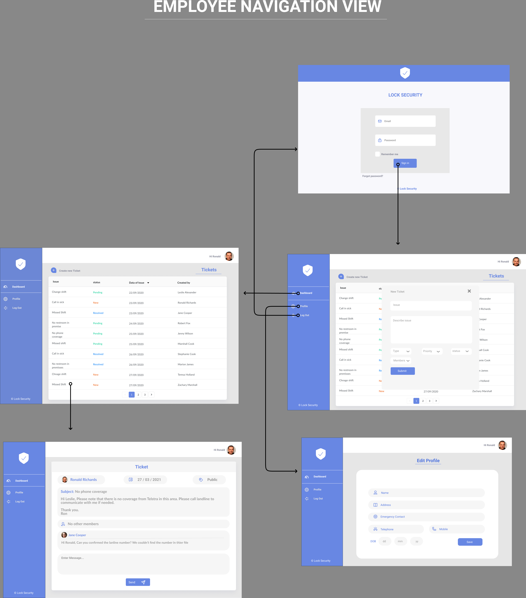
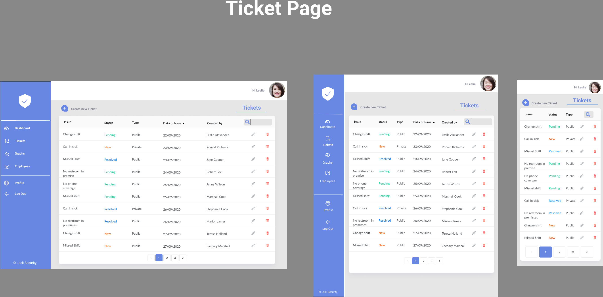
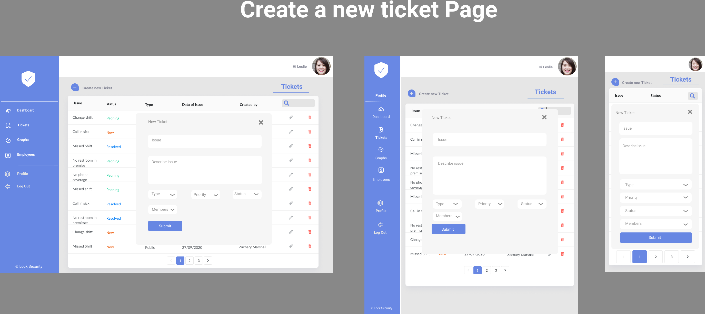
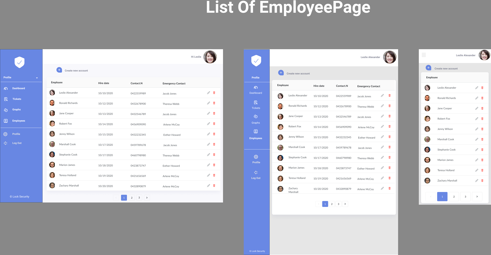
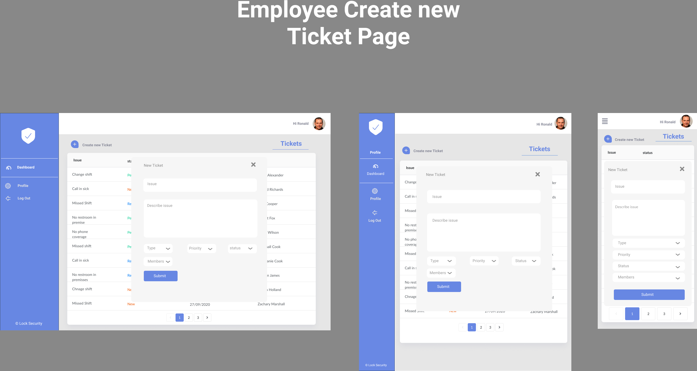
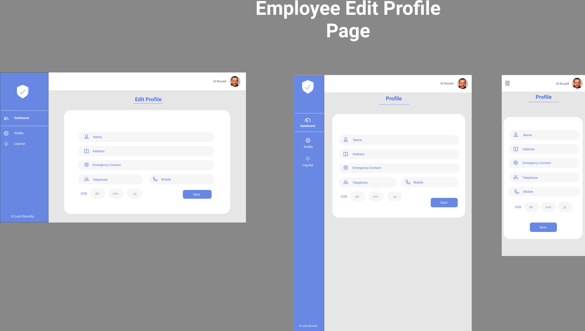

# Star Security

---

# R1 - Description of your website, including:

## Purpose

Star security is a security company that offers various services to clients. These services include providing security officer assistance to small and enterprise companies, on-site patrolling in specialized worksites, security monitoring and screening for specific areas such as airports and shopping centres, etc. The company has the obligation to run flawless and smooth operations. As a company, they must ensure and maintain trust and rapport with their clients. To achieve this, they need to have exceptional communication within their operations. However, running a security company with multiple clients and employees is not always a smooth sail. They run into issues on a regular basis concerning both parties of the operation. Some examples to these issues could be;

- Security officer calling in sick an hour before their shift
- Security officer has an emergency and has to leave the jobsite ASAP
- Client does not want to work with the security officer
- Security officer does not show up to worksite
- Security officer falls asleep on the job
- Client without notification needs more security officers

The purpose of this application is to provide a software platform for the security company to manage all their issues effectively. This application aims to provide issue tracking of operations to be managed in a way that is convinient and time efficient.

## Functionality / Features

### Authentication

The application has an authentication system where users need to sign up and sign in to the program to perform tasks and contribute to issues. This functionality provides features to handle actions that require for users to be identified when creating issues, contributing to issues, making comments and reviews, creating and editing personal accounts.

### Authorization

Authorization system allows protect the management of issues and handling access to personal profiles. The authority to manipulate issues will only belong to users which the issue was posted by, or the administrator of the application. The authority to update details on user's profiles also belong to either the user itself or the administrator.

### Issue Feature

Users are able to create issues after being authenticated to use the application. Users can be added and removed from the issue tickets regarding the needs. Issues have statuses such as resolved and ongoing, private and public. Issues have a priority preference that determines which issue needs to be attented in what urgency.

### Communication

The application has a messaging system in the issue tickets where users can communicate with each other or leave comments about any particular subject.

### Visual Data Display

The application visualizes statistics that are an outcome of the issue management. The program visualizes statuses of issues which are resolved, ongoing or at no progress. It visualizes the amount of issues posted by frequency. It also uses visual representation of issues according to priority.

### Administrator

The application has an admin feature where the user who is given admin status has the authority and privileges to view and modify everything that is going on throughout the application.

### Roll Managament

Users in the program can have different roles assigned to them by the admin users.

## Target audience

The target audience of this application is the collective group of employees and managers in the Star Security company. Personnel should be able to effectively use the application and contribute to issues posted.

## Tech stack

- Backend

  - **Node** - JavaScript runtime built on Chrome's V8 JavaScript engine.
  - **Express** - Express is a back end web application framework for Node.js
  - **mongoose** - Mongoose is a MongoDB object modeling tool designed to work in an asynchronous environment.

- Frontend

  - **React** - React is a front-end JavaScript library for building user interfaces based on UI components.
  - **JavaScript** - JavaScript is a high-level, interpreted programming language that conforms to the ECMAScript specification.
  - **HTML** - HTML is the standard markup language for Web pages.
  - **CSS** - CSS is the language used to style an HTML document.
  - **material ui** - MUI provides a simple, customizable, and accessible library of React components.

- Database

  - **MongoDB** - MongoDB is a source-available cross-platform document-oriented database program.

- Testing Libraries

  - **Jest** - JavaScript testing framework.

- External Services

  - **Firebase Authentication** - Firebase Authentication provides authentication for backend services.
  - **Heroku** - Heroku is a platform as a service that enables developers to operate applications in the cloud.
  - **Netlify** - Hosting and serverless backend services for web applications and static websites.
  - **AWS S3** - Service that provides object storage through a web service interface.

- Node Packages

  - **React Router** - Routing library for the React.
  - **Axios** - Promise based HTTP client for the browser and node.js

- Tools
  - **Trello** - Trello is a web-based, Kanban-style, list-making application.
  - **Figma** - Web-based, vector graphics editor and prototyping tool.
  - **Git** - Version control system.
  - **GitHub** - Internet hosting for software development and version control using Git.

---

# R2 - Dataflow Diagram

---

# R3 - Application Architecture Diagram

# R4 - User Stories

### User Personas

### MVP for Employee

|   Role   | Story |
| :------: | :---- |
| Employee |

- As an employee, I want to be able to login to my account when I want need to use the apllication, and logout safely after I am done using it.  
- As an employee, I want to be able to update my personal details, after I have successfully signed into the application. 
- As an employee, I want to be able to publish an issue when I come across a problem, so that the managers could be notified and the issue could be addressed. 
- As an employee, I want to be able to set the priority status of my issue, because there might be some urgent issues that need to be prioritised. 
- As an employee, I want to be able to set the status of my issue to either public or private, because I might not want to share the details of some problems with every employee. 
- As an employee, I want to be able to edit my issue, as I could have made a typo or would like to add missing information to my issue.  |

| Possible Extension for Employee |

- As an employee, I want to be able to add other participants to my issue ticket.  
- As an employee, I want to be able to participate in resolving issues that are made available to me.  
- As an employee, I want to be able to see the comments posted by other employees on issue tickets, as I might have a gone through a similar situation, and might be able to help resolving the issue.  
- As an employee, I want to be able to reply to comments posted by other employees on issue tickets, so I can contribute in solving the problem.  
- As an employee, I want to be able to view the issues that are made available to me.
- As an employee, I want to receive a notification when I am tagged on an issue ticket, so I can see it or reply if needed.   |

| Admin |

- As an admin, I want to be able to have an admin role, so that I can manage Employee information.  
- As an admin, I want to be able to create an account for the employee, so they can have access to the application with their account details.  
- As an admin, I want to be able to view all issues regardless of their status, whether they are resolved, in progress or new.  
- As an admin, I want to be able to filter issues by either the date, name, priority, type and status they were posted to find relative information faster.  
- As an admin, I want to have the ability of updating and deleting all issues posted by employees.  
- As an admin, I want to be able to have access to issues with private status, as employee may share sensible information.  
- As an admin, I want to be able to see how many employees published an issue, so that I can see new, pending and resolved issues.  
- As an admin, I want to be able to update the status from new to either pending or resolved.   |

| Possible Extension for Admin |

- As an admin, I want to be able to access visual charts that represent statistics of issues.  
- As an admin, I want to have the ability of updating and deleting all comments made on issues by employees.   |

# R5 - Wireframes for multiple standard screen sizes, created using industry standard software

## Navigation of application

### Admin Wireframe

### Employee wireframes

# R6 - Screenshots of your Trello board throughout the duration of the project

### Day #1

### Day #2

### Day #3

### Day #4trello-imgs/

### Day #5

### Day #6

