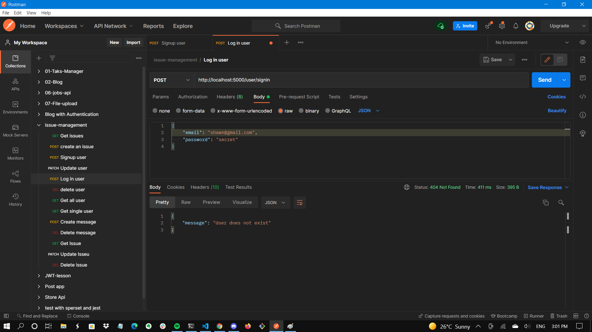

# **Lock Security**

[Deployed Website - Locksecurity.net](http://locksecurity.net)

## GitHub repository

#### [Back-end Repository](https://github.com/ahmetterturk/issue-management-backend)

#### [Front-end Repository](https://github.com/saman-zdf/issue-management-client)

<br>

# Table Of Contents

#### Part A

- [ Description of your website](#description-of-website)

  - [Purpose](#purpose)
  - [Functionality and Features](#functionality-and-features)
  - [Target Audience](#target-audience)
  - [Tech Stack](#tech-stack)

- [Dataflow Diagram](#dataflow-diagram)
- [Application Architecture Diagram](#application-architecture-diagram)
- [User Stories](#user-stories)
- [Wireframes](#wireframes)
- [Trello](#trello)

#### Part B

- [Install](#install)
- [Libraries](#libraries)
- [Management Methodology](#management-methodology)
- [Testing](#user-testing)
- [Acknowledgement](#acknowledgement)

---

# Description of website

## Purpose

Lock security is a security company that offers various services to clients. These services include providing security officer assistance to small and enterprise companies, on-site patrolling in specialized worksites, security monitoring and screening for specific areas such as airports and shopping centres, etc. The company has the obligation to run flawless and smooth operations. As a company, they must ensure and maintain trust and rapport with their clients. To achieve this, they need to have exceptional communication within their operations. However, running a security company with multiple clients and employees is not always a smooth sail. They run into issues on a regular basis concerning both parties of the operation. Some examples to these issues could be;

- Security officer calling in sick an hour before their shift
- Security officer has an emergency and has to leave the jobsite ASAP
- Client does not want to work with the security officer
- Security officer does not show up to worksite
- Security officer falls asleep on the job
- Client without notification, needs more security officers

The purpose of this application is to provide a software platform for the security company to manage all their issues effectively. This application aims to provide issue tracking of operations to be managed in a way that is convinient and time efficient.

## Functionality and Features

### Authentication

The application has an authentication system where users need to sign in to the program to perform tasks and contribute to issues. This functionality provides features to handle actions, that require users to be identified when creating issues, contributing to issues, making comments and reviews, creating and editing personal accounts.

### Authorization

Authorization system, allows protect the management of issues and handling access to personal profiles. The authority to manipulate issues will only belong to users which the issue was posted by, or the administrator of the application. The authority to update details on user's profiles also belong to either the user itself or the administrator.

### Issue Feature

Users are able to create issues after being authenticated to use the application. Users can be added and removed from the issue tickets regarding the needs. Issues have statuses such as resolved and ongoing, private and public. Issues have a priority preference that determines which issue needs to be attented in what urgency.

### Communication

The application has a messaging system in the issue tickets where users can communicate with other users. This option will allow users to leave comments about any particular subject.

### Visual Data Display

The application visualizes statistics that are an outcome of the issue management. The program visualizes statuses of issues which are new, pending or resolved. It visualizes the amount of issues posted by frequency and it also uses visual representation of issues according to priority.

### Administrator

The application has an admin feature where the user who is given admin status has the authority and privileges to view and modify everything that is going on throughout the application.

### Roll Managament

Users in the program can have different roles assigned to them by the admin users.

## Target Audience

The target audience of this application is the collective group of employees and managers in the Lock Security company. Personnel should be able to effectively use the application and contribute to issues posted.

## Tech stack

- Backend

  - **Node** - JavaScript runtime built on Chrome's V8 JavaScript engine.
  - **Express** - Express is a backend web application framework for Node.js
  - **mongoose** - Mongoose is a MongoDB object modeling tool designed to work in an asynchronous environment.

- Frontend

  - **React** - React is a front-end JavaScript library for building user interfaces based on UI components.
  - **JavaScript** - JavaScript is a high-level, interpreted programming language that conforms to the ECMAScript specification.
  - **HTML** - HTML is the standard markup language for Web pages.
  - **CSS** - CSS is the language used to style an HTML document.
  - **material ui** - MUI provides a simple, customizable, and accessible library of React components.

- Database

  - **MongoDB** - MongoDB is a source-available cross-platform document-oriented database program.

- Testing Libraries

  - **Jest** - JavaScript testing framework.
  - **Cypress** - JavaScript testing framework.

- External Services

  - **Firebase Authentication** - Firebase Authentication provides authentication for backend services.
  - **Heroku** - Heroku is a platform as a service that enables developers to operate applications in the cloud.
  - **Netlify** - Hosting and serverless backend services for web applications and static websites.
  - **AWS S3** - Service that provides object storage through a web service interface.

- Node Packages

  - **React Router** - Routing library for the React.
  - **Axios** - Promise based HTTP client for the browser and node.js

- Version Control

  - **Git** - Software for tracking changes in any set of files, usually used for coordinating work collaboratively developing source code.
  - **Github** - Hosting for software development and version control using Git.

- Tools

  - **Trello** - Trello is a web-based, Kanban-style, list-making application.
  - **Figma** - Web-based, vector graphics editor and prototyping tool.

---

# Dataflow Diagram

### Initial Version


### Fianl Version


---

# Application Architecture Diagram

### Initial Version


### Final Version


<hr/>

# User Stories

### **User Personas**


### MVP for Employee

### **Employee**

<br>

- Ronald would like to have a safe authentication system within the application.
  - As an employee, I want to be able to log in to my account when I need to use the application and log out safely after I am done using it.
    <br>
    <br>
- Ronald would like to have access to his account for updating his details.
  - As an employee, I want to be able to update my details, after I have successfully signed into the application.
    <br>
    <br>
- Ronald would like to report an issue if there is one while his on duty.
  - As an employee, I want to be able to publish an issue when I come across a problem so that the managers could be notified and the issue could be addressed.
    <br>
    <br>
- Ronald would like to see a comment from management first on the issue he has published.
  - As an employee, I would like to be able to check comments which have been added by management so that I can reply to the comments.
    <br>
    <br>
- Ronald would like to prioritize any problem he reports.
  - As an employee, I want to be able to set the priority status of my issue, because there might be some urgent issues that need to be prioritized.
    <br>
    <br>
- Ronald would like to have an option to set his issue either to public or private. He might have sensitive information which he does not want to share with other employees.
  - As an employee, I want to be able to set the status of my issue to either public or private, because I might not want to share the details of some problems with every employee.
    <br>
    <br>
- Ronald would like to have an option to modify the issue he reports if there is any typo or misinformation.
  - As an employee, I want to be able to edit my issue, as I could have made a typo or would like to add missing information to my issue.
    <br>
    <br>

#### Possible Extension for Employee

- Ronald would like to tag other employees (s) to the existing issue, as they might be able to help to solve the problem, or have gone through something similar.
  - As an employee, I want to be able to add other participants to my issue ticket.
    <br>
    <br>
- Ronald would like to be assigned to other issues that he might be able to help resolve, to the existing problem for other employees
  - As an employee, I want to be able to participate in resolving issues that are made available to me.
    <br>
    <br>
- Ronald would like to add comments on others employees' issues that he might have a possible solution to.
  - As an employee, I want to be able to see the comments posted by other employees on issue tickets, as I might have gone through a similar situation, and might be able to help resolve the issue.
    <br>
    <br>
- Ronald would like to have access to the comments so he can share his opinion on the existing problem.
  - As an employee, I want to be able to reply to comments posted by other employees on issue tickets, so I can contribute to solving the problem.
    <br>
    <br>
- Ronald would like to be able to see other issues if they are visible to him.
  - As an employee, I want to be able to view the issues that are made available to me.
    <br>
    <br>
- Ronald would like to be notified if he has been assigned to an issue.
  - As an employee, I want to receive a notification when I am tagged on an issue ticket, so I can see it or reply if needed.
    <br>
    <br>

### **Admin**

- Leslie would like to have full control over the application as an Admin, as she is a manager at Lock Security.
  - As an admin, I want to be able to have an admin role, so that I can manage Employee information.
    <br>
    <br>
- Leslie would like to create an account for an employee and give them their login details so that they can sign in to the application. As a manager, she is responsible for creating an account for employees' use on the platform.
  - As an admin, I want to be able to create an account for the employee, so they can have access to the application with their account details.
    <br>
    <br>
- Leslie would like to check and view all the issues after they have been published so that she can keep track of them.
  - As an admin, I want to be able to view all issues regardless of their status, whether they are resolved, in progress, or new.
    <br>
    <br>
- Leslie would like to search through the issues, to find a specific issue she is looking for, instead of going one by one at a time.
  - As an admin, I want to be able to filter issues by either the date, name, priority, type, and status they were posted to find relative information faster.  
    <br>
    <br>
- Leslie would like to have access to updating and/or removing issues if it's needed. In the case a problem is resolved, for example, has a typo or there is no possible solution for the specific problem.
  - As an admin, I want to have the ability to update and delete all issues posted by employees.
    <br>
    <br>
- Leslie would like to have access to all the issues being published regardless of their status, as there might be some issues with private information.
  - As an admin, I want to be able to have access to issues with private status, as the employee may share sensible information.
    <br>
    <br>
- Leslie would like to see all different statuses for existing issues to keep better track of them.
  - As an admin, I want to be able to see how many employees published an issue, so that I can see new, pending, and resolved issues.
    <br>
    <br>
- Leslie would like to update the status of existing issues once they get resolved.
  - As an admin, I want to be able to update the status from new to either pending or resolved.
    <br>
    <br>
- Leslie would like to leave a comment on an existing issue, reply or delete them if it's needed.
  - As an admin, I want to have the ability to update and delete all comments made on issues by employees so employees.
    <br>
    <br>

#### Possible Extension for Admin

- Leslie would like to see all issues represented on graphs as a visual aid, so that she can keep track of issues being published weekly, monthly, or yearly, depending on their status, priority, or type.
  - As an admin, I want to be able to access visual charts that represent statistics of issues.
    <br>
    <br>

<hr/>

# Wireframes

## Navigation of application

On the following images below we have mapped out navigation flow of each page of the application from the start point which is a login page.

<details>
  <summary>Wireframes</summary>
  


### Admin Wireframe

- Login page
  
- Dashboard page
  
- Tickets page
  
- View ticket page
  
- Create a new ticket page
  
- List of employees page
  
- Create account / Sign up page
  
- Graph and statistic page
  

### Employee wireframes

- Dashboard page
  
- Create ticket page
  
- View ticket page
  
- Edit account / profile page
  

</details>

---

# Trello

We decided to use Trello, as our project management tool to keep track of our group progress and assign tasks to each member of the group. <br>

Initially, we started at the planning phase, looking for the best idea to challenge us as junior developers. By using Trello, all cards must go through the following process to keep track of our features/tasks;

- Backlog
- To Do
- In progress
- On Hold
- Done

During this project, as a Team we will apply Scrum rituals, to succeed in delivering this application. With the use of Labels, Assign to Member options, Checklists, Dates and other Power-ups, we will be able excel on our project. <br>

This is a link to the project management tool [Trello](https://trello.com/b/OiNyPtJn/issue-tracker)

<hr>

### Day #1


### Day #2


### Day #3


### Day #4


### Day #5


### Day #6


### Day #7


<br>

# **Install**

Installation to check the Development environment

First you need to fork or clone the repository and run in your command line

```
git clone git@github.com:saman-zdf/issue-management-client.git
```

Navigate to the root directory nad you can either run

```
npm install
```

or

```
yarn install
```

to install all dependencies in order to run the application.

Next you need to run either:

```
npm start
```

or

```
yarn start
```

to run the server for the client side.

if you need to see the server Development environment, first you need to fork or clone the server repository and run in your command line

```
git clone git@github.com:ahmetterturk/issue-management-backend.git
```

To install all dependencies you need to navigate to root directory and run:

```
npm install
```

There some different API sush as database key, cloudinary(image upload), jwt secret key and etc. You need to provide your own key in order the run the server and see the result. Keys are:

```
<!-- mongoDB uri needed -->
DATABASE_URI
<!-- Cloudinary api key and name -->
CLOUD_NAME
CLOUD_API_KEY
CLOUD_API_SECRET
<!-- JWT secret key wich you create your own string -->
JWT_SECRET
```

Once you have all keys you can create .env file on the root directory and place all your keys in that file.

You can run to run the server

```
npm run dev
```

<br>

# **Libraries**

### Backend Libraries

|      Library       | Description                                                                                                                                                       |
| :----------------: | :---------------------------------------------------------------------------------------------------------------------------------------------------------------- |
|      express       | Express is a minimal and flexible Node.js web application framework that provides a robust set of features for web and mobile applications.                       |
|      mongoose      | Object modeling tool designed to work in an asynchronous environment                                                                                              |
|    jsonwebtoken    | A library used for implementation of JSON Web Tokens                                                                                                              |
|      bcryptjs      | A library to help you hash passwords.                                                                                                                             |
|        cors        | CORS is a node.js package for providing a Connect/Express middleware that can be used to enable CORS with various options.                                        |
|       dotenv       | Dotenv is a module that loads environment variables from a .env file into process.env.                                                                            |
|        jest        | Jest is a JavaScript testing framework                                                                                                                            |
|     supertest      | SuperTest is an HTTP assertions library that allows you to test your Node. js HTTP servers.                                                                       |
|      nodemon       | nodemon is a tool that helps develop node.js based applications by automatically restarting the node application when file changes in the directory are detected. |
|     cloudinary     | Cloudinary is a cloud service that offers a solution to a web application's entire image management pipeline.                                                     |
| express-fileupload | Simple express middleware for uploading files.                                                                                                                    |

---

### Frontend Libraries

|     Library      | Description                                                                                        |
| :--------------: | :------------------------------------------------------------------------------------------------- |
|      react       | Front-end JavaScript library for building user interfaces based on UI components.                  |
|       mui        | MUI provides a robust, customizable, and accessible library of foundational and advanced component |
|     chart.js     | JavaScript charting library                                                                        |
| react-chartjs-2  | React components for Chart.js                                                                      |
|    jwt-decode    | library that helps decoding JWTs token which are Base64Url encoded                                 |
|       jest       | Jest is a JavaScript testing framework                                                             |
|      moment      | library for parsing, validating, manipulating, and formatting dates.                               |
| react-router-dom | Routing library for the React JavaScript library.                                                  |
|    react-dom     | serves as the entry point to the DOM and server renderers for React                                |
| react-hook-form  | library used for building React forms with validations                                             |
|  react-scripts   | This package includes scripts and configuration used by Create React App.                          |

---

<br>

## **Management Methodology**

### **Scrumban**

The Team has decided to use the [Scrumban](https://www.infolio.co/post/how-to-get-started-with-scrumban) Methodology.
Agile project management using scrumban is a relatively new hybrid methodology that combines Scrum with Kanban. Kanban's flexibility is combined with the structure of
Scrum to create a unique approach to managing projects.

Scrumban works on the principle of planning-on-demand rather than working in timeboxed sprints, and tasks are assigned by the team as long as they can accommodate them, like in Kanban. As a result, work in progress is limited, and the development team can concentrate on tasks at hand instead of worrying about what the sprint review will reveal.

There's more to it than just Kanban. The Scrumban process maintains a daily Scrum with reviews and retrospectives only used when needed to optimize the process. As a result of the lack of sprints, planning is done as-needed, rather than around a sprint, potentially saving time.

### **Trello Screentshots**

<details>
  <summary>Week 1</summary>
  <summary>7/Dec/21</summary>


  <summary>8/Dec/21</summary>


  <summary>9/Dec/21</summary>


  <summary>10/Dec/21</summary>


</details>

<details>

  <summary>Week 2</summary>
  <summary>13/Dec/21</summary>


  <summary>14/Dec/21</summary>


  <summary>15/Dec/21</summary>


  <summary>16/Dec/21</summary>


 <summary>17/Dec/21</summary>


</details>

<details>

  <summary>Week 3</summary>
  <summary>20/Dec/21</summary>


  <summary>21/Dec/21</summary>


  <summary>22/Dec/21</summary>


</details>

<details>

  <summary>Week 4</summary>
  <summary>27/Dec/21</summary>


  <summary>28/Dec/21</summary>


  <summary>29/Dec/21</summary>


  <summary>30/Dec/21</summary>


 <summary>31/Dec/21</summary>


</details>

<details>

  <summary>Week 5</summary>
  <summary>3/Jan/22</summary>


  <summary>4/Jan/22</summary>


  <summary>5/Jan/22</summary>


  <summary>6/Jan/22</summary>


 <summary>7/Jan/22</summary>


 <summary>9/Jan/22</summary>


 </details>

 <details>

  <summary>Week 6</summary>
  <summary>10/Jan/22</summary>


  <summary>11/Jan/22</summary>


  <summary>12/Jan/22</summary>


  <summary>13/Jan/22</summary>


 <summary>14/Jan/22</summary>


 <summary>16/Jan/22</summary>


 </details>

<br>

### **Task Delegation**

As a Team, we decided to use Planyway to manage, track and balance the team's tasks throughout the project. It was a great tool used to visualize the project's roadmap and to provide the Team with direction as how to progress. At our [Daily Meetings](https://trello.com/c/kYgANaK3), the person managing the meeting would decide the tasks the team would work on, and add it Trello. Planyway would automatically track the progress of every task and create a calendar with all past, current and future tasks.

<details>
  <summary>Week 1</summary>
  <summary>8/Dec/21</summary>


  <summary>9/Dec/21</summary>


  <summary>10/Dec/21</summary>


</details>

<details>

  <summary>Week 2</summary>
  <summary>13/Dec/21</summary>


  <summary>14/Dec/21</summary>


  <summary>15/Dec/21</summary>


  <summary>16/Dec/21</summary>


 <summary>17/Dec/21</summary>


</details>

<details>

  <summary>Week 3</summary>
  <summary>20/Dec/21</summary>


  <summary>21/Dec/21</summary>


  <summary>22/Dec/21</summary>


</details>

<details>

  <summary>Week 4</summary>
  <summary>27/Dec/21</summary>


  <summary>28/Dec/21</summary>


  <summary>29/Dec/21</summary>


  <summary>30/Dec/21</summary>


 <summary>31/Dec/21</summary>


</details>

<details>

  <summary>Week 5</summary>
  <summary>3/Jan/22</summary>


  <summary>4/Jan/22</summary>


  <summary>5/Jan/22</summary>


  <summary>6/Jan/22</summary>


 <summary>7/Jan/22</summary>


 <summary>9/Jan/22</summary>


 </details>

 <details>

  <summary>Week 6</summary>
  <summary>10/Jan/22</summary>


  <summary>11/Jan/22</summary>


  <summary>12/Jan/22</summary>


  <summary>13/Jan/22</summary>


 <summary>14/Jan/22</summary>


 </details>

<br>

---

## **User Testing**

<br>

#### - **Development Environment**

<details>
  <summary>User testing postman</summary>

#### 1. User signup


#### 2. User login


#### 3. Update user


#### 4. delete user


#### 5. All users


#### 6. Single user


<br>

## Issues

#### 7. All issues


#### 8. Single issue


#### 9. Create issue


#### 10. Update issue


#### 11. Delete issue


#### 12. Create message


#### 13. Delete message


#### 14. Signin with wrong password


#### 15. Signin with wrong email



#### 16. Singup with existing email


#### 17. Delete user with wrong token


#### 18. Create issue with wrong token


#### 19. Delete issue with wrong token


#### 20. Update issue with wrong token


</details>

<br>

#### - **Production Environment**

Link to [Lock Security](https://docs.google.com/spreadsheets/d/1Fw4zb-6sjoZg3VTr4ZUjRHxAVZFopGknQ-BvnhJAorI/edit?usp=sharing) - Manual Testing

<br>

### Formal Testing Framework

<details>
  <summary>Tests</summary>
 


</details>

<br>

---

### **Acknowledgement**

- Ahmet Erturk
- Arturo Caceres
- Mohammad Reza Fayazi

---
